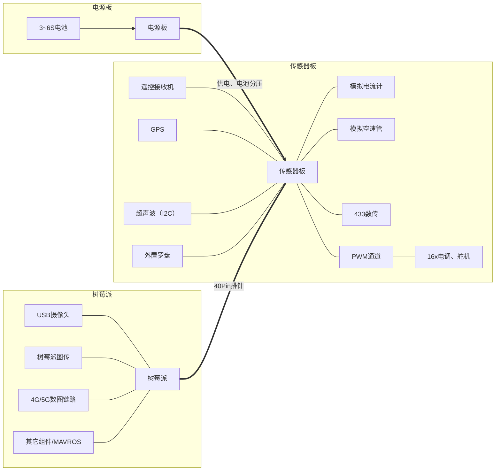
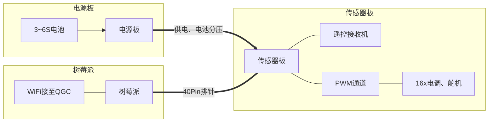

# PilotPi
### 概述
以外围最小化、功能最大化、可持续更新支持为目标而设计的树莓派飞控拓展版，适用于中型多旋翼（450轴距以上）、固定翼、车辆、船舶等其他模型。支持PX4，无APM支持企划。
系统整体为全功能设计，限于接口数量而无冗余备份，暂无IMU恒温，适应于一般场合以及二次DIY，不适应于对稳定性具有严格要求的场合。
软件驱动部分全部开源且集成进PX4，无需额外的内核驱动支持，可直接运行于最新版本的Raspberry Pi OS，可持续更新系统。（注：两路扩展串口依赖于树莓派相应的设备树，具有官方支持。此扩展板与CSI摄像头冲突，将无法使用树莓派CSI摄像头，但不影响USB总线）
分为传感器板与电源板两部分，搭配使用时只需将总电源输入接至3~6S电池，无需其它组件。
集成ICM42688与QMC5883作为IMU方案。
支持一路串行遥控输入。（目前测试通过SBUS，不支持PPM）
提供两路串口用于连接外部数传与GPS，同时提供一路I2C总线用于连接外部罗盘
板载电池电压监控，空余三路ADC，可连接模拟电流计、模拟空速计

### 芯片方案
- Acc+Gyro: ICM42688
- Mag: QMC5883
- Baro: MS5611
- PWM: PCA9685
- ADC: ADS1115
- UART: SC16IS752
- VREF: REF5050
- RC反相器: NC7SZ86M5
- PWR: XL4015 + L78L06

### 提供接口
- 1x UART RX only: 可配置硬件反向，作为SBUS输入，2.54mm三脚排针
- 2x UART: 由SC16IS752引出，连接GPS与数传，6脚1.25mm插座，支持硬件流控
- 1x I2C: 连接外置罗盘，与内置罗盘共享总线
- 16x PWM输出通道: 由PCA9685引出，12bit精度，可配置频率
- 3x 拨片开关: 分别控制RC硬件反向、板载参考压源、一路GPIO（可编程为启动模式选择）
- 4x 16位ADC: 电池电压监测（板载分压，3~6S）+三路空余通道（可配置为模拟量空速计+模拟量电流计+板上电源监测）

### 完整系统构成
需要额外的三方器件实现，全功能的PX4飞行栈

### 最小系统构成
不添加任何外围器件，满足自稳飞行需求

- 9轴IMU
- 电池电压监测
- 16路PWM输出
- 遥控输入

