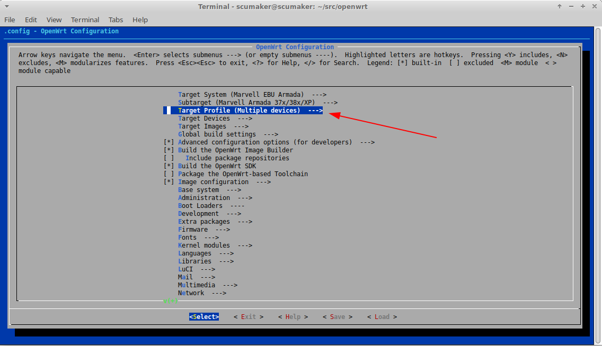
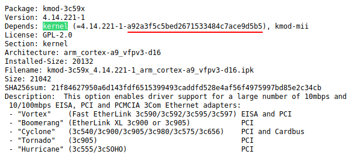

# 手动编译OpenWRT并打NAT补丁

## 0x0 环境

使用了一台x86_64的headless的Ubuntu服务器作为实验设备。该服务器由18.04滚至20.04而来，但应该不影响后续环境。

目标设备为[WRT32X](https://openwrt.org/toh/hwdata/linksys/linksys_wrt32x_v1_venom)，是工坊使用那台路由器。

## 0x1 安装依赖

OpenWRT的文档可谓是非常丰富（英文的）。

首先，去看[OpenWRT官网](https://openwrt.org/)。这是所有信息的来源。

左边栏里看一看，嗯，`Documentation => Developer guide`，直接点进去。

立马就看到了[Build Images Quickstart](https://openwrt.org/docs/guide-developer/quickstart-build-images)点进去。

从`1. Prerequisites`开始过文档。

按照官网[examples of package installations](https://openwrt.org/docs/guide-developer/build-system/install-buildsystem#examples_of_package_installations)安装依赖

首先在apt前通通

```
sudo apt update
```

更新软件列表。

文档里写了Ubuntu对应包的安装命令：

```
sudo apt install build-essential ccache ecj fastjar file g++ gawk \
gettext git java-propose-classpath libelf-dev libncurses5-dev \
libncursesw5-dev libssl-dev python python2.7-dev python3 unzip wget \
python3-distutils python3-setuptools rsync subversion swig time \
xsltproc zlib1g-dev 
```

运行即可。

`1.3`中的内容忽略即可，意思是不要使用root权限执行。

然后获取源码：

```
git clone https://git.openwrt.org/openwrt/openwrt.git
```

cd进去`cd openwrt`

**以下命令均在这个目录下执行**

我们要编译当前最新的发布版。

##### Q: 为什么要编译最新发布版

- opkg软件源只有各大发布版
- 只有内核配置和官方一致才能使用在线软件源
- 发布版“稳定性可保障”“问题可溯源”

切换HEAD到某个发布版。

```
git checkout v19.07.7
```

然后更新feeds：

```
./scripts/feeds update -a
./scripts/feeds install -a
```

## 0x2 配置目标

接下来配置编译目标。为了和官方版本保持相同的构建参数，需要从官方build bot那里拿到对应的`.config`。**从这里开始与官方教程不同，这些内容为增补官方教程**

对于这块板子，文件url是`https://downloads.openwrt.org/releases/19.07.7/targets/mvebu/cortexa9/config.buildinfo`。它在固件下载目录下。找到它的方法很简单：

1. 去Download页找到[ToH](https://openwrt.org/toh/views/toh_fwdownload)，在里面找到设备
2. 复制固件链接，如`http://downloads.openwrt.org/releases/19.07.7/targets/mvebu/cortexa9/openwrt-19.07.7-mvebu-cortexa9-linksys_wrt32x-squashfs-factory.img`
3. 删除最后的文件名后访问`http://downloads.openwrt.org/releases/19.07.7/targets/mvebu/cortexa9/`
4. 页面最下方即可找到`config.buildinfo`

下载该文件并命名为`.config`：

```
curl https://downloads.openwrt.org/releases/19.07.7/targets/mvebu/cortexa9/config.buildinfo -o .config
```

下载到的`.config`是最小化的，需要将其展开：

```
make defconfig
```

接下来再次跟随官方教程，筛选编译目标。

#### Q: 为什么要下载这个文件

1. 不下载这个，直接编译，需要手动配置各种包，比如默认情况下luci都不会包含进去
2. 为了不和在线软件源产生冲突
3. 保证内核选项与官方一致，才能使用官方源下载内核相关的包

现在从build bot下载的配置文件会编译当前架构的所有设备，我们不需要所以重新只选择我们要的设备：

```
make menuconfig
```



进去选择WRT32X。

方向键选择`Save`回车保存。再选择`Exit`退出。

此时源码的配置就完成了。

## 0x3 首次编译

```
make -j20
```

我CPU有20个线程核心。`-j`后面的数值按需修改。

实际建议开个screen再编译，避免中途需要断开连接的问题：

```
screen -S make_openwrt
```

然后在screen里执行make。想撇后台可以摁`CTRL + A + D`去detach。再次来的时候`screen -r make_openwrt`即可。

## 0x4 检查 vermagic

只有使用**和官方一致**的编译配置才能安全的使用在线软件源。opkg因此拥有这么一套检查机制。如果vermagic值不匹配的话就无法以后使用opkg在线安装部分内核模块的包。

> vermagic is that 45ed73a630a4bec3328fc33ca1c2e1c2
>  and is a hash calculated from
>
> - all compilation options related to kernel, and
> - names of all kernel modules enabled in the kernel compilation .config (either =y or =m)

参阅[这里](https://forum.openwrt.org/t/cannot-use-released-kernel-module-for-compile-openwrt/50075/12)

首先获取本地编译的vermagic

```
cat ./build_dir/target-*/linux-*/linux-*/.vermagic
```

会打引出一串md5，即为当前编译得到的vermagic

再去openwrt官方软件源寻找官方的vermagic。操作方法：

1. 去上文提到过的固件url目录那里（自己按需修改）`https://downloads.openwrt.org/releases/19.07.7/targets/mvebu/cortexa9`
2. 页面下方有`packages`目录，点进去
3. 有一个`Packages`文件，打开它。

这个文件就是软件包列表。如果浏览器直接打开了这个文件，那么就搜索`kernel`。如果浏览器下载了这个文件，那就本地用工具，搜索`kernel`：



任何一个依赖kernel的包都可以说明问题。划线处即为官方vermagic。

现在对比本地编译得到的vermagic和官方值。如果一致，那就继续。不一致请检查上述步骤有无遗漏。

现在已经成功编译得到了和官方镜像配置一致的发布版。

## 0x5 NAT补丁

这里的NAT补丁特指[Chion82](https://github.com/Chion82/netfilter-full-cone-nat)与[LGA1150](https://github.com/LGA1150/openwrt-fullconenat)的FullCone补丁，以及相关其它补丁。

##### Q: 为什么要这个补丁

- 我们是Zerotier等内网穿透用户群体。一个FullCone NAT能够带来非常舒适的直连体验

当然，从masquerade换到fullcone理论会导致一些安全性问题。也不排除一些鲁棒不佳的socket服务爆炸。

### 概览

可以找到的类似于开始页面的地址是： https://github.com/LGA1150/openwrt-fullconenat

通过阅读README可知，一共需要patch三个地方：

- 一个新的package作为iptables扩展
- 一个luci的patch，用于图形化配置nat类型
- 一个内核patch

如果我们要对内核进行patch，那就必须得自己编译整个系统镜像。其它两个都可以作为扩展进行部分编译。但是既然都要编译了不如全部编译一遍。

### 打内核补丁

注：当前该补丁适用于4.14内核

```
wget -P target/linux/generic/hack-4.14/ https://raw.githubusercontent.com/coolsnowwolf/lede/a4773cf258ead39a427576dae524f07d3334d582/target/linux/generic/hack-4.14/952-net-conntrack-events-support-multiple-registrant.patch
```

### 添加fullconenat包

下载源码。这一步直接将源码放进了代码树中。

```
git clone -b master --single-branch https://github.com/LGA1150/openwrt-fullconenat package/fullconenat
```

配置编译选项

```
make menuconfig
```

在`Network -> Firewall -> iptables-mod-fullconenat`这个位置把该选项前面的`<>`摁两次空格改为`<*>`，意为直接编译进镜像。

使用方向键选择`Save`后再选择`Exit`退出

### 添加luci补丁

```
mkdir package/network/config/firewall/patches
wget -P package/network/config/firewall/patches/ https://github.com/LGA1150/fullconenat-fw3-patch/raw/master/fullconenat.patch
pushd feeds/luci
wget -O- https://github.com/LGA1150/fullconenat-fw3-patch/raw/master/luci.patch | git apply
popd
```

### 绕过vermagic

对内核动了手脚，vermagic已经变了。为了能够继续使用在线软件源，需要欺骗openwrt。

这一步有风险，但是鉴于只添加了nat补丁而没有动其它配置，也就只能这样。

> Use at your own risk.

将之前编译得到的`.vermagic`复制出来：

```
cp ./build_dir/target-*/linux-*/linux-*/.vermagic .
```

修改内核mk中生成vermagic的代码：

```
sed -i -e 's/^\(.\).*vermagic$/\1cp $(TOPDIR)\/.vermagic $(LINUX_DIR)\/.vermagic/' include/kernel-defaults.mk
```

再次进行编译。

重做`0x3`和`0x4`

## 0x6 完成

编译得到的系统镜像在`./bin/target/*/*/`

## 0xf 参考

构建官方一致的镜像： https://openwrt.org/docs/guide-developer/build-system/use-buildsystem#build_system_usage

本地编译的vermagic： https://libremesh.org/development-kernel_vermagic.html

vermagic来源： https://forum.openwrt.org/t/cannot-use-released-kernel-module-for-compile-openwrt/50075/12

bypass vermagic calc: https://oldwiki.archive.openwrt.org/doc/howtobuild/tl-mr3420.build#kmod_compatibility_hack
